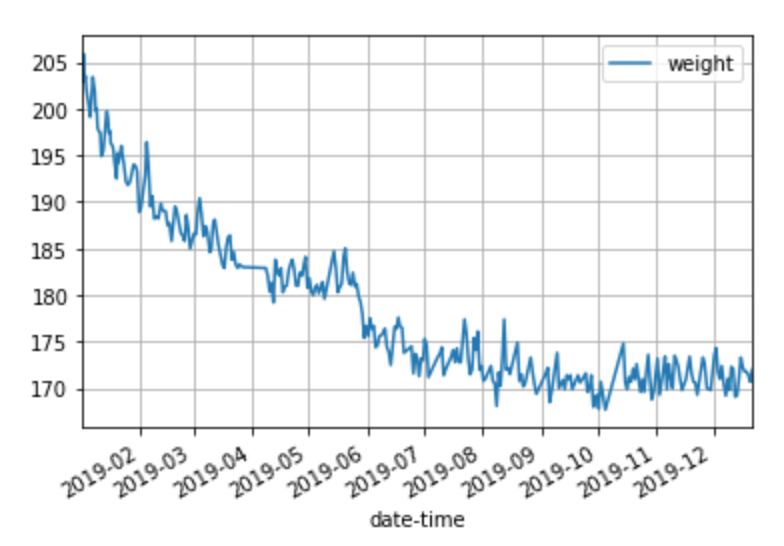

Generally a good year. Had ups and downs but ended positively I think. Got promoted and a raise which was good (now time to hedge lifestyle inflation).

Huge change for me this year was losing over 30 pounds and really shifting my lifestyle. I think I am more confident overall because of this, feel better about myself, and have more confidence in my ability to reach other goals as well. I'm really happy people supported me in this, and that I was able to see that goal through the end.

I wanted to include a note about simplicity. I have been working on simplifying different aspects of my life. I want to have less apps, less commitment (like groups/events to attend), less stuff, etc. I think this is valuable right now for me, in that my most valuable asset is my brain and the more I am able to let it focus on *important* things, the better. Am I the right person to judge importance/priority? Maybe not, but can't get better at that without trying.

I am really excited about sports/analytics/gambling space. Also really excited about the real estate space. I am less excited about machine learning and AI. I do get excited about building/internalizing robust data driven processes, that we can use to leverage/upend existing systems. What I am trying to say is that I don't want to solve a problem (e.g. betting on hockey) with machine learning for the sake of using ML, but I want to get good at understanding the data, the math, and some coding to be able to leverage those tools to make good decisions, insights. I think this is the future and I want to be on top of this wave.

Trips:

- Barcelona/Portugal
- Vegas
- Montauk
- Ithaca
- Hong Kong/Korea(!)

Goals from 2019:

- reach weight <185 lbs and sustain that weight: finished, see graph below
- be able to do 20 wide grip pull ups in a row: came close but didn't do
- bench press my body weight: didn't do
- be able to run a 5k in 25 minutes: finished
- save $10,000 (~3 months rent + living expenses) in high interest savings account to be ready in case of emergency: finished
- set aside $200 per paycheck to dollar cost average into index funds: finished
- read 18 books by the end of next year: finished

