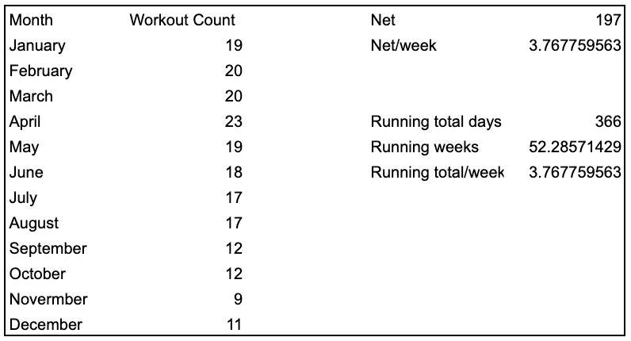
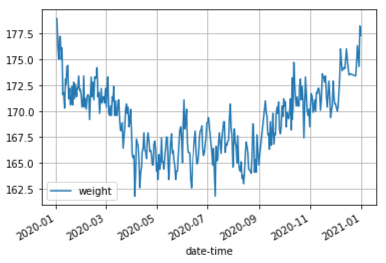

A good year personally. Health - able to maintain generally positive habits despite quarantine and the pandemic, notably I ran a half marathon (not in an actual race, just measured distance) with my friend in NYC in October. Work - I was able to switch internally at my job to a new team (same company, new role) and got promoted within that team at the end of the year.

For the first time I can remember in my professional career, I am looking "inward" for the next step. During internships, in school, and during my first two years, I have always been looking for the next jump, and I've always looked externally (in job, company, etc.). I haven't cut back on any professional hedonism, but now I am not looking to make another "jump" (still always open to consider, of course) and instead focusing my efforts on how I can get better in my current seat. This is pretty small but feels like a significant mindset shift and I am excited to improve where I am at.

I am thankful to have remained healthy and safe throughout the pandemic. It was distopian not leaving apartment for 2-ish weeks at the very start of the shutdown. During April and May, I only went outside on weekends and didn't leave the 3 block radius around my apartment. I spent most of my time sitting (or pacing) for 12-15 hours a day in my apartment. The eery feeling of going for the "first walk" in May after months of complete lockdown was something I never would have expected a few months before. I can feel myself mentally cringing when I watch old movies and people aren't wearing masks. During quarantine, I rode the explosion of online fitness (like Isaac Boots and torched), and revived cooking and grocery shopping (always online) that I hadn't really done in months. Reflecting, I personally felt the "pulling forward" of megatrends. I was lucky to spend time with family in Syracuse in the summer and continue working remote from there, and finally return to the office (with weekly COVID testing) after Labor Day. I'm greatful for the silver linings, like golfing with dad every saturday, paddleboarding the finger lakes, and being closer throughout to the people I love.

I had planned on taking trips to Las Vegas, Miami, Alaska, and potentially Italy. Thankfully, I was still able to travel (via car, to safe areas) and spend time outside of the city and my hometown.

Trips:

- Troutbeck
- Montauk
- Syracuse
- Virginia
- Rhode Island

Goals from 2020:

- 20 books: didn't finish, but to be fair I do the majority of my reading traveling and on the exercise bike in my gym, both of which were blocked by the pandemic
- average 3.5 workouts/week: finished
- max contributions to my 401k (using automatic contributions every paycheck): finished
- continue dollar cost averaging and automatic savings (this is in place, goal really is to not need to stop doing it): finished
- maintain current weight (mainly stay under 180 lbs, this should be a side effect of doing 3.5 workouts/week): finished

I've been thinking a lot about building and setting myself up for the freedom to live the life I want in the future. As much as I can, I want to control my own destiny and be my own boss. I am currently in a W2 job, so I am (by default) building someone else's dream. I am okay with this as I am being compensated reasonably (I think), I am learning something valuable and new, and I view the situation as low downside/high upside investment of my time. Nonetheless, I want to "build my own dream" as well. I am going to work on building a portfolio of stuff (assets that will generate cashflow) that should compound in the future. I am not looking to leave my job, so I want to achieve this by picking up one "income generating investment per year" and holding forever. I am more flexible now than I probably ever will be in the future and want to take advantage of the time while I can. I also want to get skin in the game to truly learn about myself and from experiences. This will be a big mental focus for me over the next year.

